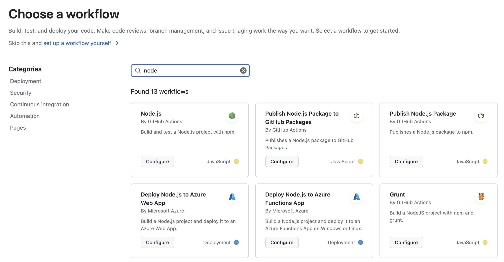
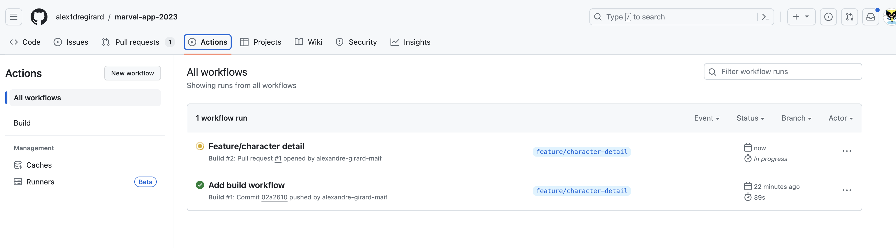
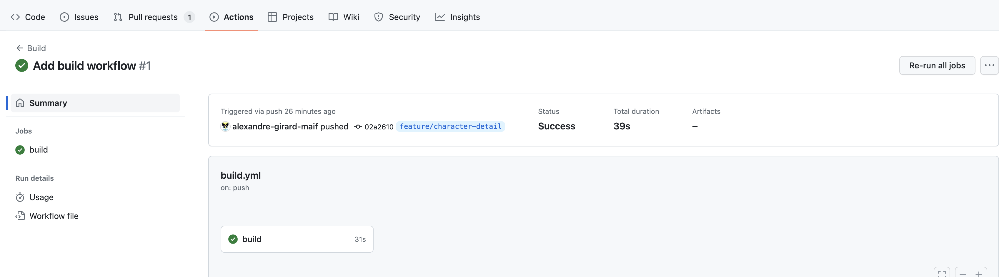
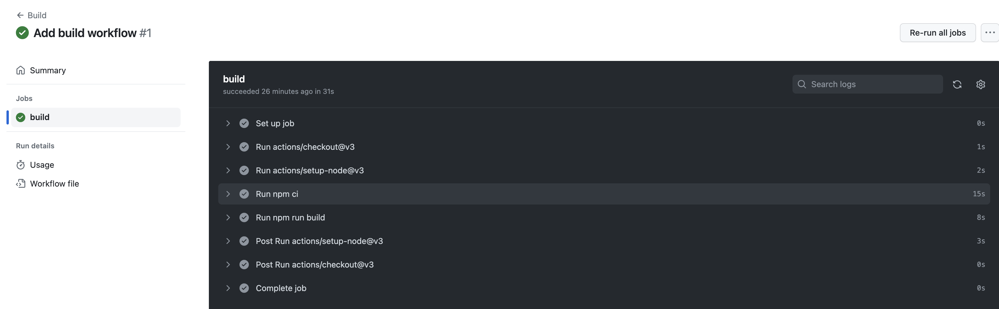

# Actions

Les `Actions` github sont des scripts qui peuvent être déclenchés par des événements sur le dépôt. Ils sont stockés dans le dossier `.github/workflows` du dépôt. Les actions sont définies dans un fichier YAML. 

Les actions peuvent être déclenchées par différents événements, elles permettent d'automatiser des tâches.

Les actions peuvent être déclenchées par différents événements :

- `push` : lorsqu'un commit est poussé sur le dépôt
- `pull_request` : lorsqu'une pull request est créée ou mise à jour
- `schedule` : à intervalle régulier
- `workflow_dispatch` : lorsqu'un événement est déclenché manuellement

Nous allons plus particulièrement nous intéresser aux actions qui se déclenchent sur des événements de `Push` et de `Pull Request`. En effet afin de sécuriser le dépôt, nous allons mettre en place des actions qui vont vérifier que le code qui est poussé sur le dépôt est conforme à certaines règles.

Il s'agit de la première étape de la mise en place d'un processus de `Continuous Integration` (CI). L'intégration continue est un processus qui permet de vérifier que le code qui est poussé sur le dépôt est conforme à certaines règles. on s'assure ainsi en continu que le code est fonctionnel et qu'il respecte les règles de codage que l'on a définies.

## Création d'une action

### Exemple d'un workflow prédéfini

github propose un certain nombre de workflow prédéfinis en fonction du langage utilisé. Nous allons utiliser le workflow `Node.js` qui permet de lancer des actions sur un projet Node.js.



Fichier YAML généré par github :

```yaml
# This workflow will do a clean installation of node dependencies, cache/restore them, build the source code and run tests across different versions of node
# For more information see: https://docs.github.com/en/actions/automating-builds-and-tests/building-and-testing-nodejs

name: Node.js CI

on:
  push:
    branches: [ "develop" ]
  pull_request:
    branches: [ "develop" ]

jobs:
  build:

    runs-on: ubuntu-latest

    strategy:
      matrix:
        node-version: [14.x, 16.x, 18.x]
        # See supported Node.js release schedule at https://nodejs.org/en/about/releases/

    steps:
    - uses: actions/checkout@v3
    - name: Use Node.js ${{ matrix.node-version }}
      uses: actions/setup-node@v3
      with:
        node-version: ${{ matrix.node-version }}
        cache: 'npm'
    - run: npm ci
    - run: npm run build --if-present
    - run: npm test
```

Cet exemple contient plusieurs parties :

- La partie `name` permet de donner un nom au workflow. C'est le nom qui sera affiché dans l'interface de github.
- La partie `on` permet de définir les événements qui vont déclencher le workflow. Dans cet exemple, le workflow sera déclenché sur les événements `push` et `pull_request` sur la branche `develop`.
- La partie `jobs` permet de définir les jobs qui vont être exécutés par le workflow. Dans cet exemple, il n'y a qu'un seul job qui s'appelle `build`.
    - La sous-partie `build` permet de définir un job. Dans cet exemple, le job s'appelle `build`.
        - La sous-partie `runs-on` permet de définir l'environnement sur lequel le job va être exécuté. Dans cet exemple, le job va être exécuté sur une machine `ubuntu-latest`. Github propose plusieurs environnements : Linux, Windows, MacOS. Sauf cas particulier, on utilise généralement l'environnement `ubuntu-latest`.
        - La sous-partie `strategy` permet de définir une matrice, ici on définit une matrice de versions de Node.js. Dans cet exemple, le job va être exécuté sur les versions 14, 16 et 18 de Node.js.
        - La sous-partie `steps` permet de définir les étapes qui vont être exécutées par le job. Dans cet exemple, il y a 5 étapes qui vont être exécutées :
            - `actions/checkout@v3` : permet de récupérer le code du dépôt
            - `actions/setup-node@v3` : permet de configurer l'environnement Node.js
            - `npm ci` : permet d'installer les dépendances du projet
            - `npm run build --if-present` : permet de construire le projet si un script `build` est défini dans le fichier `package.json`
            - `npm test` : permet de lancer les tests

La documentation de github permet de comprendre le fonctionnement de chaque partie du fichier YAML : [https://docs.github.com/en/actions/learn-github-actions/workflow-syntax-for-github-actions](https://docs.github.com/en/actions/learn-github-actions/workflow-syntax-for-github-actions){target=_blank}

## Exécution d'une action

Pour les actions qui se déclenchent sur un événement `push`, l'action est exécutée sur la branche qui a déclenché l'événement. Pour les actions qui se déclenchent sur un événement `pull_request`, l'action est exécutée sur la branche de la pull request.

Dès qu'un événement est déclenché, le workflow est exécuté. On peut suivre l'exécution du workflow dans l'onglet `Actions` du dépôt.



Pour chaque workflow, on peut voir son état, son nom, la branche sur laquelle il a été déclenché, la date de déclenchement, le commit qui a déclenché le workflow, le numéro de la pull request si le workflow a été déclenché par une pull request, le temps d'exécution.

Dans cet exemple, le workflow `Build` a été déclenché par un événement `push` sur la branche `feature/character-detail` et est en succès. Il est également en cours d'exécution pour la pull request `#1`.

En cliquant sur le nom du workflow, on peut voir les détails de l'exécution du workflow.



On peut ensuite voir les détails de chaque job.



Ici, on peut voir que le job `build` contient 8 étapes. Certaines sont des étapes prédéfinies par github: 

- Set up job
- Complete job

D'autres sont des étapes définies dans le fichier YAML, ce sont celles-ci qui nous intéressent :

- checkout
- setup-node
- npm ci
- npm run build

Elles peuvent générer une post-action:

- setup-node
- checkout

Les étapes prédéfinies par github permettent de configurer l'environnement d'exécution du job. Les post-actions permettent de nettoyer l'environnement d'exécution du job.

## Aller plus loin

On peut faire beaucoup de choses avec les actions github, aussi bien en réaction à des événements sur le dépôt qu'en déclenchant des événements sur le dépôt (manuellement ou en fonction d'un calendrier). Mais nous n'allons pas rentrer dans les détails ici.

Pour aller plus loin, vous pouvez consulter la documentation de github : [https://docs.github.com/en/actions](https://docs.github.com/en/actions){target=_blank}
