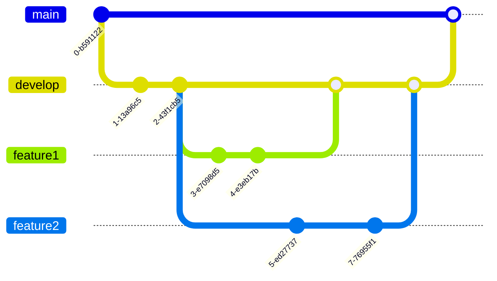
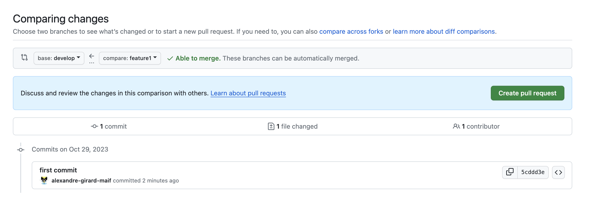
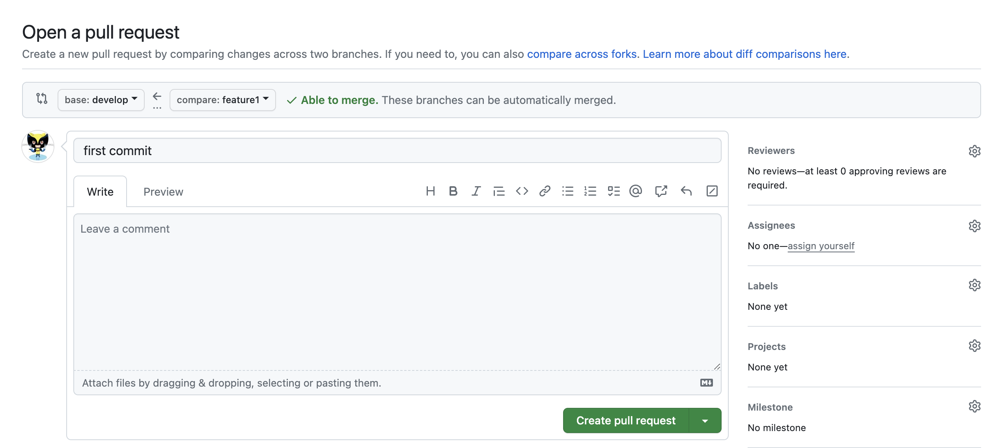
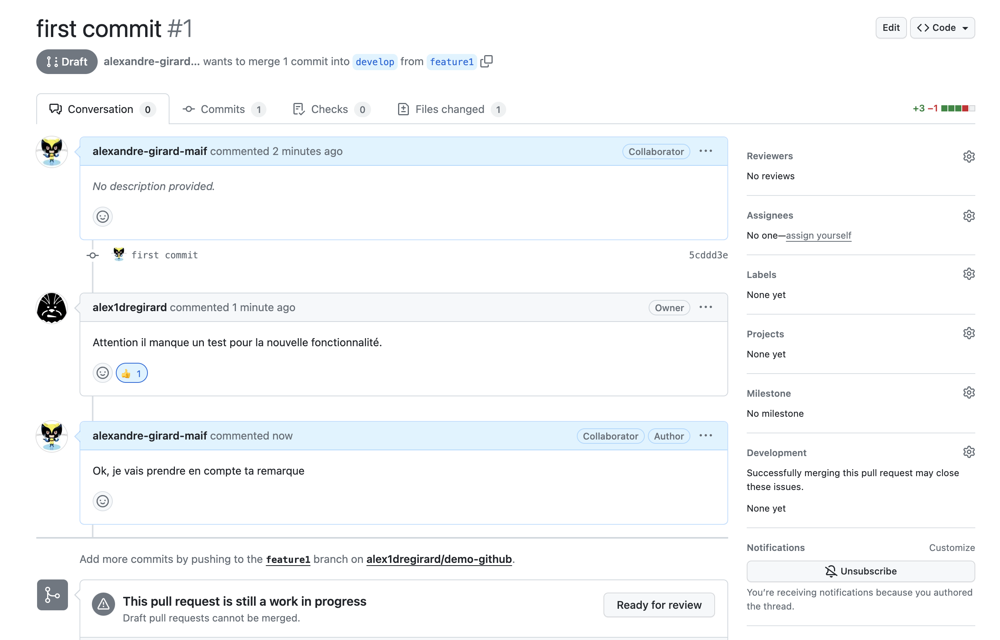

Une bonne pratique de développement est de ne jamais travailler directement sur la branche `main`. En effet, cette branche contient le code de production. Il est donc important de travailler sur une branche de développement, qui contiendra le code en cours de développement. Une fois que le code est prêt, il est fusionné dans la branche `main`.

Des commandes `git` permettent de créer et de fusionner des branches. Cependant, il existe des outils qui permettent de faciliter le processus de création et de fusion de branches. La fusion d'une branche étant une étape importante dans le processus de développement, il est utile de se servir d'un outillage qui permet de faciliter cette étape.

En effet avant de fusionner une branche dans une autre, il est important de vérifier que le code de la branche à fusionner ne contient pas de conflits avec le code de la branche dans laquelle on veut fusionner. Il est également important de vérifier que le code de la branche à fusionner ne contient pas de régression, que l'applicatif fonctionne toujours correctement.

On peut aussi vouloir ajouter des étapes de validation avant de fusionner une branche dans une autre. Par exemple, on peut vouloir que le code de la branche à fusionner soit validé par un autre développeur avant de pouvoir la fusionner dans la branche principale. Que le code soit de qualité, qu'il respecte les conventions de codage, qu'il soit testé, etc.

github outille cette étape de validation en proposant un mécanisme de pull request.

La pull request est le moyen par lequel vous pouvez proposer des modifications de code à un projet. Elle permet de signaler aux autres contributeurs que vous avez terminé une fonctionnalité ou une correction de bug. Une fois une pull request ouverte, vous pouvez discuter et revoir les modifications proposées avec les autres contributeurs et ajouter des commits supplémentaires avant que les changements soient fusionnés dans la branche cible.

Pour expliquer le processus de pull request, nous allons utiliser l'exemple suivant, se basant sur le workflow GitFlow :

- une branche `main` qui contient le code de production.
- une branche `develop` qui contient le code de développement.
- une branche `feature1` qui contient le code d'une nouvelle fonctionnalité.
- une autre branche `feature2` qui contient le code d'une autre nouvelle fonctionnalité.

## Créer une pull request

Pour créer une pull request, il faut aller sur la page du repository, puis cliquer sur le bouton `New pull request`. Une pull request est l'action de demander à fusionner une branche dans une autre. Dans notre exemple, nous allons demander à fusionner la branche `feature1` dans la branche `develop`.

Lors de la création de la pull request, vous pouvez ajouter un titre et une description. Le titre doit être explicite et doit permettre de comprendre rapidement ce que fait la pull request. La description permet de donner plus de détails sur la pull request. Par exemple, vous pouvez expliquer pourquoi vous avez fait cette pull request, quelles sont les modifications apportées, etc.

Si la pull request est toujours en cours de développement et que vous souhaitez la sauvegarder sans la publier, vous pouvez cliquer sur le bouton `Create draft pull request`. Cela permet de sauvegarder la pull request sans la publier. Vous pouvez ensuite la publier plus tard.

Une fois la pull request créée, vous pouvez la consulter. Vous pouvez voir les modifications apportées par la pull request ainsi que les commits qui ont été ajoutés, les fichiers modifiés par la pull request. Vous pouvez également voir les discussions qui ont eu lieu sur la pull request.

## Fusionner une pull request

Une fois que la pull request est prête, vous pouvez la fusionner. Pour cela, il faut cliquer sur le bouton `Merge pull request`. Si elle est en mode `draft`, il faut d'abord la publier en cliquant sur le bouton `Ready for review`.

Comme nous n'avons pas encore mis en place d'étapes de validation, nous pouvons fusionner la pull request directement. Cependant, il est possible, même conseillé de mettre en place des étapes de validation avant de pouvoir fusionner la pull request.

Si il n'y a pas de conflit, la pull request est fusionnée. Sinon, il faut d'abord résoudre les conflits avant de pouvoir fusionner la pull request.

Une fois la pull request fusionnée, vous pouvez supprimer la branche `feature1` si vous n'en avez plus besoin. Pour cela, il faut cliquer sur le bouton `Delete branch`. Il est possible de supprimer la branche directement depuis la pull request ou depuis la page du repository. 

Il est aussi possible de la supprimer automatiquement lors de la fusion de la pull request. Pour cela, il faut cocher la case `Delete branch when pull request is merged`. 

Une option générale permet de supprimer automatiquement les branches qui ont été fusionnées. Pour cela, il faut aller dans les paramètres du repository, puis dans la section `Branches`. Dans la section `Automatically delete head branches`, cochez la case `Enable auto delete head branches`.
