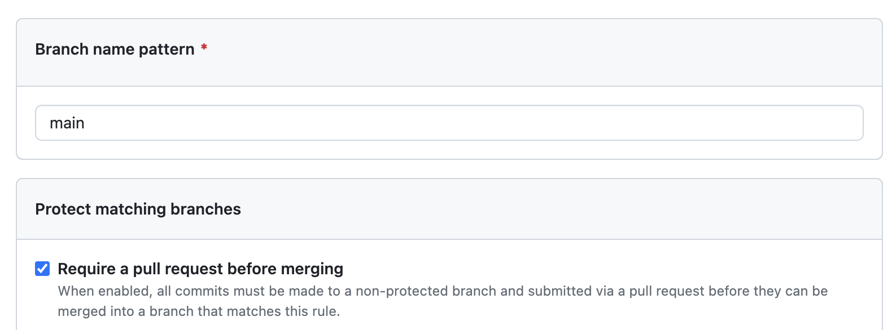
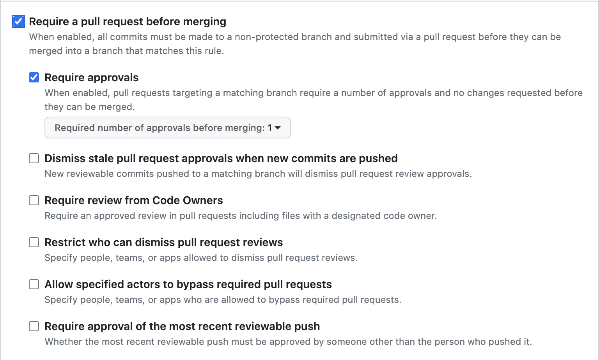

Une bonne pratique de développement est de ne jamais travailler directement sur la branche `main`. En effet, cette branche contient le code de production. Il est donc important de travailler sur une branche de développement, qui contiendra le code en cours de développement. Une fois que le code est prêt, il est fusionné dans la branche `main`.

Des commandes `git` permettent de créer et de fusionner des branches. Cependant, il existe des outils qui permettent de faciliter le processus de création et de fusion de branches. La fusion d'une branche étant une étape importante dans le processus de développement, il est utile de se servir d'un outillage qui permet de faciliter cette étape.

En effet avant de fusionner une branche dans une autre, il est important de vérifier que le code de la branche à fusionner ne contient pas de conflits avec le code de la branche dans laquelle on veut fusionner. Il est également important de vérifier que le code de la branche à fusionner ne contient pas de régression, que l'applicatif fonctionne toujours correctement.

On peut aussi vouloir ajouter des étapes de validation avant de fusionner une branche dans une autre. Par exemple, on peut vouloir que le code de la branche à fusionner soit validé par un autre développeur avant de pouvoir la fusionner dans la branche principale. Que le code soit de qualité, qu'il respecte les conventions de codage, qu'il soit testé, etc.

github outille cette étape de validation en proposant un mécanisme de pull request.

La pull request est le moyen par lequel vous pouvez proposer des modifications de code à un projet. Elle permet de signaler aux autres contributeurs que vous avez terminé une fonctionnalité ou une correction de bug. Une fois une pull request ouverte, vous pouvez discuter et revoir les modifications proposées avec les autres contributeurs et ajouter des commits supplémentaires avant que les changements soient fusionnés dans la branche cible.

Pour expliquer le processus de pull request, nous allons utiliser l'exemple suivant, se basant sur le workflow GitFlow :

- une branche `main` qui contient le code de production.
- une branche `develop` qui contient le code de développement.
- une branche `feature1` qui contient le code d'une nouvelle fonctionnalité.
- une autre branche `feature2` qui contient le code d'une autre nouvelle fonctionnalité.


## Protection des branches

### Protection de la branche `main`

Une bonne pratique est de protéger la branche `main` contre les modifications directes. Toutes les modifications doivent être faites à partir d'une pull request. Il sera donc impossible de faire un `git push` sur la branche `main`.

github vous informe d'ailleurs lorsque vous avez plusieurs branches si votre branch `main` n'est pas protégée.


Pour protéger la branche `main`, il faut aller dans les paramètres du repository, puis dans la section `Branches`. Dans la section `Branch protection rules`, cliquez sur le bouton `Add branch protection rule`.


A minima, il faut cocher la case `Require pull request before merging`. Cela permet de s'assurer que le code a été validé avant d'être fusionné dans la branche `main`.



### Protection de la branche `develop`

Même si la branch `develop` n'est pas une branche de production, il est également intéressant de la protéger contre les modifications directes. Cela permet de s'assurer que tout ce qui est fusionné dans la branche `develop` a été validé par une pull request et passe donc toutes les étapes de validation que l'on souhaite mettre en place.

Nous allons donc protéger la branche `develop` de la même manière que la branche `main`. Nous verrons plus tard comment mettre en place des étapes de validation.

### Vérification des protections

Une fois les branches `main` et `develop` protégées, vous ne pouvez plus faire de `git push` directement sur ces branches. Vous devez obligatoirement passer par une pull request. 


De même si vous passez par l'interface web de github pour modifier un fichier, vous ne pouvez plus faire un `commit` directement sur la branche `main` ou `develop`.


## Créer une pull request

Pour créer une pull request, il faut aller sur la page du repository, puis cliquer sur le bouton `New pull request`. Une pull request est l'action de demander à fusionner une branche dans une autre. Dans notre exemple, nous allons demander à fusionner la branche `feature1` dans la branche `develop`.


Lors de la création de la pull request, vous pouvez ajouter un titre et une description. Le titre doit être explicite et doit permettre de comprendre rapidement ce que fait la pull request. La description permet de donner plus de détails sur la pull request. Par exemple, vous pouvez expliquer pourquoi vous avez fait cette pull request, quelles sont les modifications apportées, etc.

Si la pull request est toujours en cours de développement et que vous souhaitez la sauvegarder sans la publier, vous pouvez cliquer sur le bouton `Create draft pull request`. Cela permet de sauvegarder la pull request sans la publier. Vous pouvez ensuite la publier plus tard.

Une fois la pull request créée, vous pouvez la consulter. Vous pouvez voir les modifications apportées par la pull request ainsi que les commits qui ont été ajoutés, les fichiers modifiés par la pull request. Vous pouvez également voir les discussions qui ont eu lieu sur la pull request.


## Fusionner une pull request

Une fois que la pull request est prête, vous pouvez la fusionner. Pour cela, il faut cliquer sur le bouton `Merge pull request`. Si elle est en mode `draft`, il faut d'abord la publier en cliquant sur le bouton `Ready for review`.

Comme nous n'avons pas encore mis en place d'étapes de validation, nous pouvons fusionner la pull request directement. Cependant, il est possible, même conseillé de mettre en place des étapes de validation avant de pouvoir fusionner la pull request.

Si il n'y a pas de conflit, la pull request est fusionnée. Sinon, il faut d'abord résoudre les conflits avant de pouvoir fusionner la pull request.

Une fois la pull request fusionnée, vous pouvez supprimer la branche `feature1` si vous n'en avez plus besoin. Pour cela, il faut cliquer sur le bouton `Delete branch`. Il est possible de supprimer la branche directement depuis la pull request ou depuis la page du repository. 

Il est aussi possible de la supprimer automatiquement lors de la fusion de la pull request. Pour cela, il faut cocher la case `Delete branch when pull request is merged`. 

Une option générale permet de supprimer automatiquement les branches qui ont été fusionnées. Pour cela, il faut aller dans les paramètres du repository, puis dans la section `Branches`. Dans la section `Automatically delete head branches`, cochez la case `Enable auto delete head branches`.

## Aller plus loin dans la sécurisation des branches

Les options de protection des branches évoluent régulièrement. Il est donc possible que les options présentées ci-dessous ne soient plus disponibles ou que de nouvelles options soient disponibles. Sont présentées ici les options qui paraissent les plus intéressantes.

### Require approvals

L'option `Require approvals` permet de définir le nombre d'approbations nécessaires avant de pouvoir fusionner la pull request. Par défaut, il faut une approbation. Vous pouvez augmenter ce nombre si vous souhaitez que plusieurs personnes valident la pull request avant de pouvoir la fusionner.



Cette option est intéressante si vous souhaitez que le code soit validé par plusieurs personnes avant de pouvoir le fusionner. Cela permet de s'assurer que le code est de qualité, qu'il respecte les conventions de codage, qu'il est testé, etc.

### Dismiss stale pull request approvals when new commits are pushed

L'option `Dismiss stale pull request approvals when new commits are pushed` permet de supprimer les approbations lorsque de nouveaux commits sont ajoutés à la pull request. Cela permet de s'assurer que les approbations sont toujours valides.

### Require review from Code Owners

L'option `Require review from Code Owners` permet de s'assurer que les propriétaires du code ont validé la pull request avant de pouvoir la fusionner. Pour cela, il faut créer un fichier `CODEOWNERS` à la racine du repository. Ce fichier permet de définir les propriétaires du code.

Par exemple, si vous avez un fichier `README.md` et que vous souhaitez que les propriétaires du code soient `user1` et `user2`, il faut ajouter la ligne suivante dans le fichier `CODEOWNERS` :

```text
README.md @user1 @user2
```

Ainsi, lorsque vous créerez une pull request qui modifie le fichier `README.md`, les utilisateurs `user1` et `user2` seront automatiquement ajoutés comme reviewers de la pull request.

### Require status checks to pass before merging

L'option `Require status checks to pass before merging` permet de s'assurer que les étapes de validation ont été exécutées avant de pouvoir fusionner la pull request. Pour cela, il faut créer des étapes de validation, c'est grâce à ces étapes de validation que l'on pourra s'assurer que la pull request est valide en fonction des critères que l'on souhaite.

Par exemple :

- le code est valide, par exemple pour un projet écrit dans un langage compilé, le code compile.
- le code respecte les conventions de codage.
- le code est testé et les tests passent.
- la couverture de test est suffisante.
- la qualité du code est suffisante.
- ...

Les status checks sont des étapes de validation qui sont exécutées à chaque fois que vous faites un `git push`. Il s'agit d'actions qui sont exécutées par github ou par des outils tiers. Par exemple, github propose des status checks pour vérifier que le code compile, que les tests passent, que la couverture de test est suffisante, etc. Voir la page [Actions](./actions.md) pour plus de détails.
