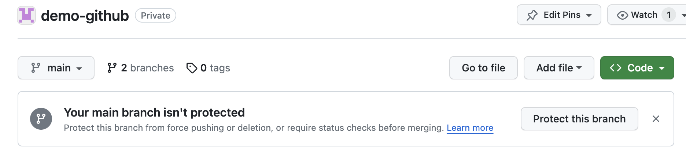
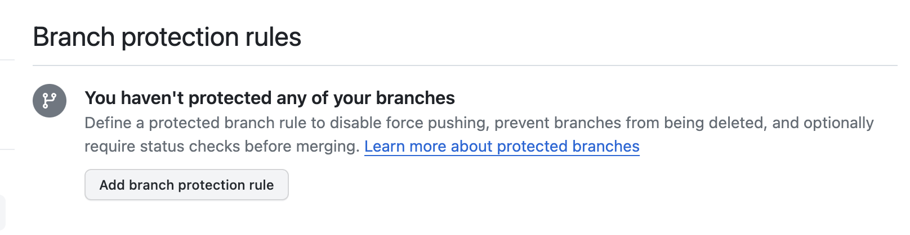
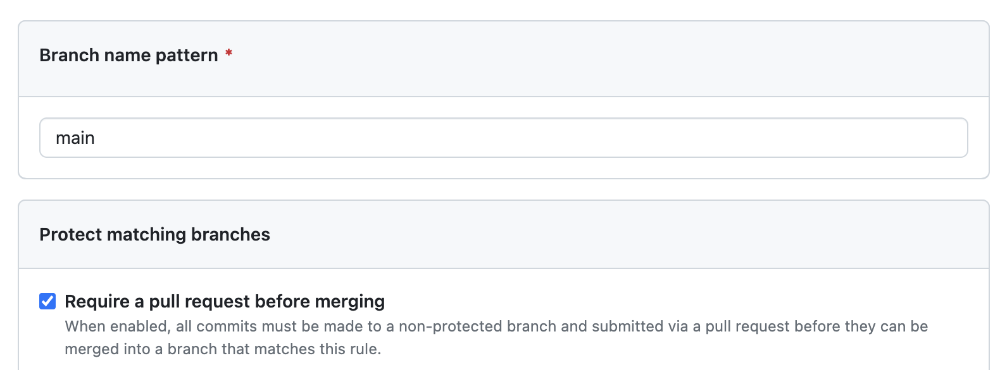
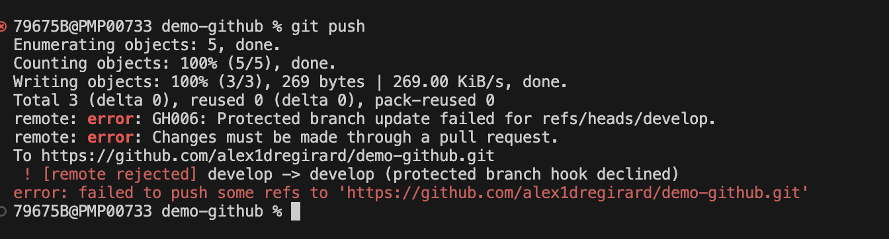
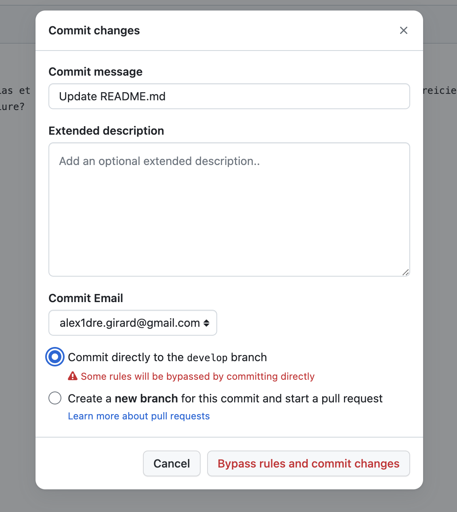
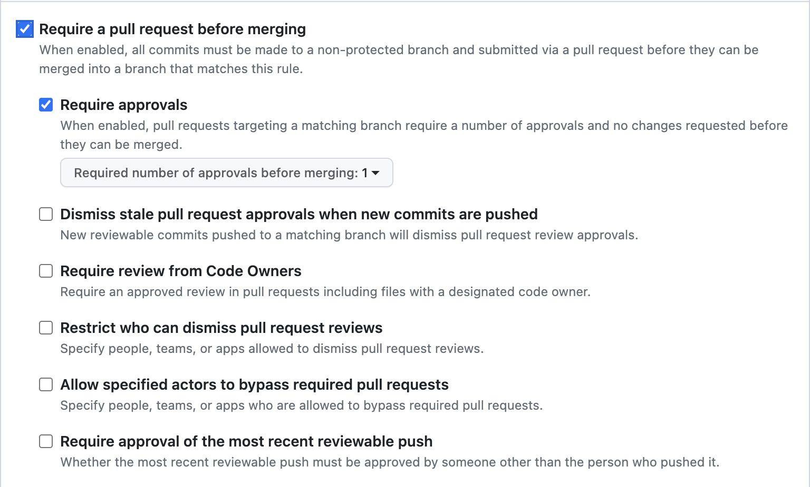

# Settings

## Protection des branches

### Protection de la branche `main`

Une bonne pratique est de protéger la branche `main` contre les modifications directes. Toutes les modifications doivent être faites à partir d'une pull request. Il sera donc impossible de faire un `git push` sur la branche `main`.

github vous informe d'ailleurs lorsque vous avez plusieurs branches si votre branch `main` n'est pas protégée.



Pour protéger la branche `main`, il faut aller dans les paramètres du repository, puis dans la section `Branches`. Dans la section `Branch protection rules`, cliquez sur le bouton `Add branch protection rule`.



A minima, il faut cocher la case `Require pull request before merging`. Cela permet de s'assurer que le code a été validé avant d'être fusionné dans la branche `main`.



### Protection de la branche `develop`

Même si la branch `develop` n'est pas une branche de production, il est également intéressant de la protéger contre les modifications directes. Cela permet de s'assurer que tout ce qui est fusionné dans la branche `develop` a été validé par une pull request et passe donc toutes les étapes de validation que l'on souhaite mettre en place.

Nous allons donc protéger la branche `develop` de la même manière que la branche `main`. Nous verrons plus tard comment mettre en place des étapes de validation.

### Vérification des protections

Une fois les branches `main` et `develop` protégées, vous ne pouvez plus faire de `git push` directement sur ces branches. Vous devez obligatoirement passer par une pull request. 



De même si vous passez par l'interface web de github pour modifier un fichier, vous ne pouvez plus faire un `commit` directement sur la branche `main` ou `develop`.



### Aller plus loin dans la protection des branches

Les options de protection des branches évoluent régulièrement. Il est donc possible que les options présentées ci-dessous ne soient plus disponibles ou que de nouvelles options soient disponibles. Sont présentées ici les options qui paraissent les plus intéressantes.

#### Require approvals

L'option `Require approvals` permet de définir le nombre d'approbations nécessaires avant de pouvoir fusionner la pull request. Par défaut, il faut une approbation. Vous pouvez augmenter ce nombre si vous souhaitez que plusieurs personnes valident la pull request avant de pouvoir la fusionner.



Cette option est intéressante si vous souhaitez que le code soit validé par plusieurs personnes avant de pouvoir le fusionner. Cela permet de s'assurer que le code est de qualité, qu'il respecte les conventions de codage, qu'il est testé, etc.

#### Dismiss stale pull request approvals when new commits are pushed

L'option `Dismiss stale pull request approvals when new commits are pushed` permet de supprimer les approbations lorsque de nouveaux commits sont ajoutés à la pull request. Cela permet de s'assurer que les approbations ne sont plus valides lorsque de nouveaux commits sont ajoutés à la pull request.

#### Require review from Code Owners

L'option `Require review from Code Owners` permet de s'assurer que les propriétaires du code ont validé la pull request avant de pouvoir la fusionner. Pour cela, il faut créer un fichier `CODEOWNERS` à la racine du repository. Ce fichier permet de définir les propriétaires du code.

Par exemple, si vous avez un fichier `README.md` et que vous souhaitez que les propriétaires du code soient `user1` et `user2`, il faut ajouter la ligne suivante dans le fichier `CODEOWNERS` :

```text
README.md @user1 @user2
```

Ainsi, lorsque vous créerez une pull request qui modifie le fichier `README.md`, les utilisateurs `user1` et `user2` seront automatiquement ajoutés comme reviewers de la pull request.

#### Require status checks to pass before merging

L'option `Require status checks to pass before merging` permet de s'assurer que les étapes de validation ont été exécutées avant de pouvoir fusionner la pull request. Pour cela, il faut créer des étapes de validation, c'est grâce à ces étapes de validation que l'on pourra s'assurer que la pull request est valide en fonction des critères que l'on souhaite.

Par exemple :

- le code est valide, par exemple pour un projet écrit dans un langage compilé, le code compile.
- le code respecte les conventions de codage.
- le code est testé et les tests passent.
- la couverture de test est suffisante.
- la qualité du code est suffisante.
- ...

Les status checks sont des étapes de validation qui sont exécutées à chaque fois que vous faites un `git push`. Il s'agit d'actions qui sont exécutées par github ou par des outils tiers. Par exemple, github propose des status checks pour vérifier que le code compile, que les tests passent, que la couverture de test est suffisante, etc. Voir la page [Actions](./actions.md) pour plus de détails.